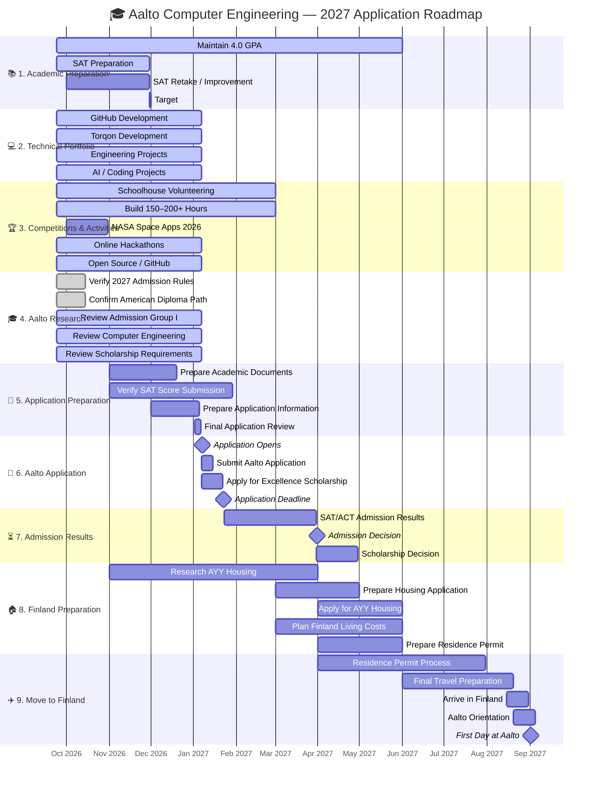

# 📘 Portfolio Roadmap (2026–2027)

This repository documents my journey from high school student to future **Computer Engineering student at Aalto University**, with a long-term goal of building advanced software and systems, working at a leading technology company such as **ASML**, and eventually pursuing a master's degree in the Netherlands or another leading European technology university.

I am currently building a strong academic, technical, project, and extracurricular profile around **computer engineering, AI, software engineering, embedded systems, simulation, and systems design**.

---

## 🎯 Goals Overview

### **2026**

* ✅ Maintain a **4.0 GPA**
* 🎯 Improve SAT score toward **1550+**
* 🚧 Continue building a strong technical GitHub portfolio
* 🚧 Develop and expand **Torqon**, my automotive AI platform
* 🚧 Continue developing engineering/simulation projects
* 🚧 Build **150–200+ volunteer hours** through Schoolhouse.world
* 🚀 Participate in **NASA Space Apps Challenge 2026**
* 🚧 Participate in additional coding, AI, and engineering competitions/hackathons
* 🚧 Build projects demonstrating AI, software engineering, systems design, and engineering skills
* 🚧 Finalize Aalto eligibility and admission-group research
* 🚧 Prepare all materials required for the **January 2027 Aalto application**

### **2027**

* 🎓 Apply to **Aalto University Bachelor's Programme in Science and Technology**
* 🎯 Apply specifically for **Computer Engineering**
* 🎯 Apply for the **Aalto University Excellence Scholarship**
* 🚧 Complete high-school graduation requirements
* 🚧 Finalize portfolio and GitHub projects
* 🚧 Prepare for relocation to Finland if admitted
* 🏠 Research and apply for **AYY student housing**
* 💰 Prepare financially for living in Finland
* 🇫🇮 Begin studies at Aalto University in **August–September 2027**, if admitted

### **Long-Term**

* 🎓 Complete Aalto Computer Engineering BSc + MSc pathway
* 💻 Develop expertise in software, embedded systems, AI, computer architecture, and systems engineering
* 🏎️ Continue combining technology with automotive/motorsport applications
* 💼 Pursue internships, research, and engineering opportunities at major technology companies
* 🎓 Consider a specialized master's/research pathway in Europe if appropriate
* 🏢 Pursue a long-term engineering career at **ASML or another leading technology company**

---

# 🎓 Target University

## Aalto University

**Target programme:**
Bachelor of Science (Technology) + Master of Science (Technology)

**Study option:**
**Computer Engineering**

**Language:** English

**Duration:** 3 + 2 years

**Application period:** **7–22 January 2027**

**Expected studies:** August–September 2027

Aalto describes Computer Engineering as combining hardware and software, including areas such as low-level programming, microelectronics, computer architecture, embedded systems, and hardware acceleration.

### Admission Path

Because I am completing an American high-school diploma outside Finland, my current Aalto application pathway is:

**American Diploma → Admission Round A → Admission Group I → SAT/ACT-based admission**

Aalto's current 2027 information states that applicants with an upper-secondary qualification completed outside Finland, including a high-school diploma, can apply through Admission Round A, where admission is based on SAT or ACT results.

### Current Aalto Target

* 🎯 **Computer Engineering**
* 🎯 Strong SAT score
* 🎯 Strong academic record
* 🎯 Strong technical portfolio
* 🎯 Meaningful extracurricular involvement
* 🎯 Competitive scholarship application

---

# 📊 Academic Profile

| Category              | Current Status                               |
| :-------------------- | :------------------------------------------- |
| **School**            | American Diploma                             |
| **Accreditation**     | Cognia-accredited school                     |
| **Location**          | Saudi Arabia                                 |
| **GPA**               | 4.0                                          |
| **SAT**               | 600 EBRW + 790 Math — current single sitting |
| **SAT Goal**          | 1550+                                        |
| **Math Goal**         | Maintain 790–800                             |
| **English Goal**      | Major improvement toward 760–800             |
| **Target University** | Aalto University                             |
| **Target Major**      | Computer Engineering                         |

**Important:** the old README listed a 1530 superscored SAT. The roadmap should no longer present that as the current Aalto score because my current Aalto strategy is based on the score that Aalto will actually consider under its applicable rules.

Aalto's current 2027 page states that SAT/ACT applicants are ranked based on their test results and that the SAT minimum is 1350 total with at least 700 in Mathematics.

---

# 🏗️ Technical Portfolio

## 1. Automotive / Motorsport Engineering

| Project                            | Status       |
| :--------------------------------- | :----------- |
| Vehicle Dynamics Calculator        | ✅ Completed  |
| FSAE Telemetry Simulator           | ✅ Completed  |
| FSAE Electronics Simulator         | ✅ Completed  |
| Additional engineering simulations | 🚧 Expanding |

These projects demonstrate interests in:

* Vehicle dynamics
* Engineering simulation
* Data analysis
* Telemetry
* Electronics
* Systems thinking
* Programming

---

## 2. Torqon — Automotive AI Platform

**Status:** 🚧 Active development

Torqon is my main large-scale software project: an **AI-powered automotive platform** focused on:

* Automotive diagnostics
* Performance analysis
* Tuning
* Modifications
* AI recommendations
* Vehicle information
* Automotive data
* AI-assisted interaction
* Visual vehicle customization
* Automotive enthusiast tools

### Technical direction

* Next.js
* React / React Native
* TypeScript / JavaScript
* Python
* Supabase
* AI APIs
* GitHub
* Cloud services
* Database systems
* AI/ML integration

### Portfolio objective

Build Torqon as a serious software product rather than simply a school project, demonstrating:

**Software Engineering + AI + Product Design + Databases + APIs + Systems Thinking**

---

# 🌐 GitHub & Open Source

**Status:** 🚧 Active

Main objectives:

* Maintain a professional GitHub profile
* Build technically substantial repositories
* Improve project documentation
* Create reusable software
* Explore AI/agent systems
* Contribute to open-source projects
* Collaborate with other developers and AI-assisted development tools
* Demonstrate consistent development activity

### Main technical interests

* AI
* Machine learning
* Software engineering
* Agent systems
* Computer engineering
* Embedded systems
* Simulation
* Data analysis
* Cybersecurity
* Systems design

---

# 🏆 Competitions & Hackathons

| Activity                       | Status                            |
| :----------------------------- | :-------------------------------- |
| NASA Space Apps Challenge 2026 | 🚀 Planned/Participating          |
| Online coding/AI hackathons    | 🚧 Seeking suitable opportunities |
| Engineering competitions       | 🚧 Exploring                      |
| AI competitions                | 🚧 Exploring                      |
| Open-source contributions      | 🚧 Developing                     |

The goal is not simply to accumulate event certificates. The focus is on producing **real technical work, demonstrable projects, teamwork, and measurable outcomes**.

---

# 🌟 Current Achievements

| Achievement               | Details                                      |
| :------------------------ | :------------------------------------------- |
| **GPA**                   | 4.0                                          |
| **SAT**                   | 600 EBRW + 790 Math — current score          |
| **SAT Target**            | 1550+                                        |
| **School**                | Cognia-accredited American curriculum school |
| **NASA Space Apps**       | 2026 participation planned                   |
| **GitHub**                | Active technical portfolio                   |
| **Engineering Projects**  | Vehicle dynamics, telemetry, electronics     |
| **Main Software Project** | Torqon                                       |
| **Volunteer Goal**        | 150–200+ hours                               |

---

# 🛠️ Skills I'm Developing

| Area                    | Technologies / Topics                             |
| :---------------------- | :------------------------------------------------ |
| **Programming**         | Python, C++, JavaScript, TypeScript               |
| **Web Development**     | Next.js, React, full-stack development            |
| **Databases**           | Supabase, PostgreSQL concepts                     |
| **AI/ML**               | AI APIs, ML fundamentals, AI applications         |
| **Engineering**         | Vehicle dynamics, simulation, systems engineering |
| **Embedded Systems**    | Electronics, telemetry, low-level systems         |
| **Data**                | Data analysis, visualization, telemetry           |
| **Development Tools**   | Git, GitHub, VS Code, Claude                      |
| **Systems**             | Architecture, APIs, software systems              |
| **Cybersecurity**       | Fundamentals                                      |
| **Product Development** | UI/UX, product architecture, deployment           |

---

# 📅 Complete Roadmap: September 2026 → Aalto



---

# 🎯 2026 Priority Stack

My priorities from now until the Aalto application are:

### **Priority 1 — Academics**

Maintain the 4.0 GPA and improve the SAT toward 1550+.

### **Priority 2 — Aalto Application**

Make sure every requirement for the 2027 application is understood and completed correctly.

### **Priority 3 — Technical Portfolio**

Continue developing Torqon and build additional technically meaningful projects.

### **Priority 4 — Extracurricular Profile**

Continue Schoolhouse volunteering and participate in relevant coding, AI, engineering, and hackathon activities.

### **Priority 5 — Evidence of Technical Ability**

Make GitHub projects polished, documented, reproducible, and demonstrably useful.

---

# 🇫🇮 Aalto → Computer Engineering → Long-Term Path

```text
2026
│
├── 4.0 GPA
├── SAT improvement
├── Torqon
├── Engineering projects
├── GitHub development
├── NASA Space Apps
├── Hackathons
└── Schoolhouse volunteering
        │
        ▼
January 2027
│
└── Aalto University Application
        │
        ▼
Admission Group I
        │
        ▼
Computer Engineering
        │
        ▼
Aalto University
2027–2032
        │
        ├── Software Engineering
        ├── Embedded Systems
        ├── AI / ML
        ├── Computer Architecture
        ├── Systems Design
        ├── Research
        ├── Internships
        └── Advanced Projects
        │
        ▼
European Master's / Advanced Study
        │
        ▼
ASML / Leading Technology Company
        │
        ▼
Software / Systems / Computer Engineering Career
```

---

# 🚀 Repository Purpose

This repository exists to document the development of my technical profile and keep me accountable throughout my journey toward Computer Engineering.

It represents my progress in:

* 🎓 Academic achievement
* 💻 Software engineering
* 🤖 Artificial intelligence
* 🔧 Computer engineering
* 🏎️ Motorsport technology
* 📊 Simulation and data analysis
* 🌐 Open source and GitHub
* 🏆 Competitions and hackathons
* 🤝 Community involvement
* 🇫🇮 Aalto University preparation

The objective is to build **real technical ability and real projects**, not simply collect credentials.

---

# 📫 Connect With Me

**GitHub:** `AbdelrahmanMostafa-Eng`

**LinkedIn:** `www.linkedin.com/in/abdelrahmanmostafa-eng`

**Instagram:** `abdelrahman_abouelkhair`

---

🚀 *Building toward Computer Engineering, AI, systems, and the future of technology — one project at a time.*
